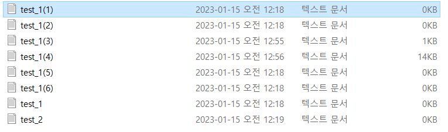
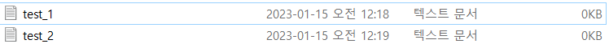
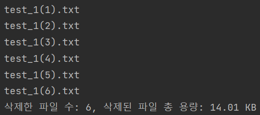

# please-delete-duplicate-files
##
'폴더 정리 좀 해!' 하는 소리 듣고 사는 사람들을 위한
디렉토리에 중복된 파일 삭제는 간단 파이썬 코드

### 설명
같은 파일명의 파일을 여러 번 다운로드 받으면 파일명 뒤에 괄호 안에 
숫자가 붙어서 다운로드되는 원리를 이용하여 파일명이 파일명(숫자).확장자 패턴의 파일을 찾아
삭제하는 코드

### 주의
삭제된 파일은 복구되지 않습니다.
파일명(숫자).확장자 하는 형식이 중복으로 존재하는 파일이며
삭제해도 되는 파일이라는 것이 확실할 때 실행하시기 바랍니다.

### 예시
####실행전

#### 실행후

콘솔에 삭제한 파일명과 삭제된 파일의 전체 용량이 출력됩니다.